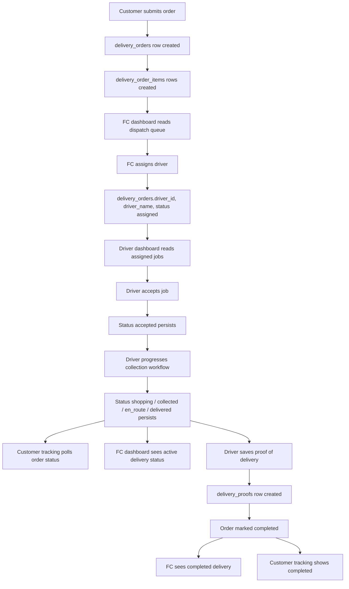

# Doorin5 Operational Artery

## Summary

Doorin5 now has a first durable operational artery for production Supabase mode:

Customer order creation, FC dispatch, driver acceptance, driver status progression, proof of delivery, completion, FC visibility, and customer tracking all flow through API routes that persist to Supabase when Supabase is configured with a service-role key.

Demo mode remains available when Supabase is unavailable or incomplete. Demo responses are still fallback-only; they keep the pages usable locally, but they are not the production source of truth.

## Lifecycle Diagram

## Production Tables Used

| Table | Purpose |
| --- | --- |
| `delivery_orders` | Source of truth for customer request, status, assignment, payment status, timestamps, and completion. |
| `delivery_order_items` | Durable item list for each order. |
| `driver_profiles` | Driver identity, availability, status, and active job count. |
| `delivery_status_events` | Append-only lifecycle event trail for status changes. |
| `delivery_proofs` | Proof-of-delivery text/photo placeholder and recipient confirmation. |
| `event_log_entries` | Operational audit entries for dispatch and completion. |
| `age_checks` | Existing table for restricted-item checks. |
| `delivery_links` | Existing secure-token link table for future customer links. |

## Status Transitions

| From | To | Actor |
| --- | --- | --- |
| `draft` | `assigned` | FC dispatch |
| `paid` | `assigned` | FC dispatch |
| `assigned` | `accepted` | Driver |
| `accepted` | `shopping` | Driver |
| `shopping` | `collected` | Driver |
| `collected` | `en_route` | Driver |
| `en_route` | `delivered` | Driver |
| `delivered` | `completed` | Driver proof/completion |

`cancelled` remains a terminal status for future support/admin cancellation work.

## API Workflow

| Step | Route | Production behavior | Demo fallback |
| --- | --- | --- | --- |
| Create order | `POST /api/orders` | Inserts `delivery_orders`, `delivery_order_items`, and initial status event. | Returns a realistic draft demo order. |
| FC summary | `GET /api/operations/summary` | Reads operational orders and driver profiles from Supabase. | Returns demo orders and demo drivers. |
| Assign driver | `POST /api/dispatch` | Updates order assignment/status and records status/event log rows. | Returns a demo assignment response. |
| Driver jobs | `GET /api/driver/jobs` | Reads assigned/active jobs from Supabase. | Returns demo driver jobs. |
| Progress status | `POST /api/driver/progress` | Advances persisted order status and records status event. | Returns demo next-status response. |
| Complete delivery | `POST /api/driver/complete` | Inserts proof and marks order completed. | Returns demo proof response. |
| Customer tracking | `GET /api/orders/[orderId]` | Reads order and returns public timeline summary. | Returns demo tracking summary. |

## Database Updates

- Added `assigned` to the order status structure.
- Added `assigned_at`, `accepted_at`, and `completed_at` timestamps.
- Added a `delivery_orders.driver_id` foreign-key relationship to `driver_profiles`.
- Added operational indexes for status, driver/status, created date, completed date, and status events.
- Enabled RLS on public tables and granted server-side service-role access.
- Updated seed data with demo driver profiles, one assigned job, and one unassigned dispatch-queue order.

## Verification Report

Environment verified locally without Supabase credentials, so local runtime verification exercised demo fallback. Production Supabase persistence is build/type verified and ready for a seeded Supabase project with `NEXT_PUBLIC_SUPABASE_URL` and `SUPABASE_SERVICE_ROLE_KEY`.

| Check | Result |
| --- | --- |
| `npm install` | Passed; dependencies already up to date. npm reports 3 pre-existing moderate audit findings. |
| `npm run build` | Passed. |
| `/` | Loaded without Next.js runtime overlay. |
| `/order` | Loaded without overlay; order form visible. |
| `/driver` | Loaded without overlay; assigned jobs and status UI visible. |
| `/fc` | Loaded without overlay; dispatch queue and operations UI visible. |
| `/track/demo-1002` | Loaded without overlay; customer lifecycle timeline visible. |
| `GET /api/operations/summary` | Passed in demo fallback. |
| `POST /api/dispatch` | Returned assigned order in demo fallback. |
| `GET /api/driver/jobs` | Returned demo jobs. |
| `POST /api/driver/progress` | Returned next persisted-equivalent status in demo fallback. |
| `POST /api/driver/complete` | Returned proof/completion payload in demo fallback. |
| `GET /api/orders/demo-1002` | Returned public tracking timeline in demo fallback. |

## Remaining Gaps

- Live Supabase project still needs the updated SQL applied and seeded before production E2E verification.
- `/driver` and `/fc` are still public routes; role-based authentication is not implemented.
- Stripe Checkout and webhook confirmation are still mocked/not revenue-ready.
- Proof of delivery is text/confirmation only; photo upload and storage policies are still needed.
- Customer notifications are not implemented.
- Driver navigation links are placeholders.
- RLS is enabled, but app-level user policies should be added after auth roles are introduced.
- Driver active-job counts are updated by the current assignment/completion path, but a scheduled reconciliation query would be safer for production.

## Readiness Scores After This Change

| Area | Score |
| --- | ---: |
| MVP readiness | 82% |
| Revenue readiness | 48% |
| Production readiness | 58% |

## Recommended Next Tasks

1. Apply `supabase/schema.sql` and `supabase/seed-demo.sql` to a real Supabase project.
2. Run the full production workflow with real Supabase env vars and capture database rows after each lifecycle step.
3. Add auth guards for `/fc`, `/driver`, and operational API routes.
4. Add real Stripe Checkout Session creation from order summary.
5. Add Stripe webhook verification and payment status persistence.
6. Add customer SMS/email confirmation and status notifications.
7. Add driver map links for pickup and dropoff addresses.
8. Add Supabase Storage proof photo upload and storage policies.
9. Add cancellation, exception, and refund handling.
10. Add automated Playwright smoke tests for customer, FC, driver, and tracking workflows.
